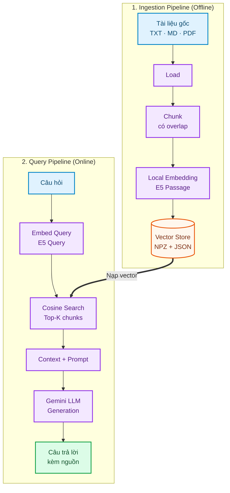
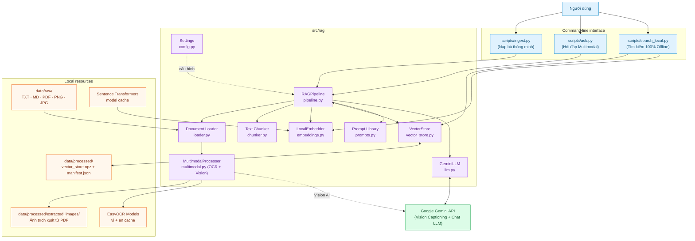
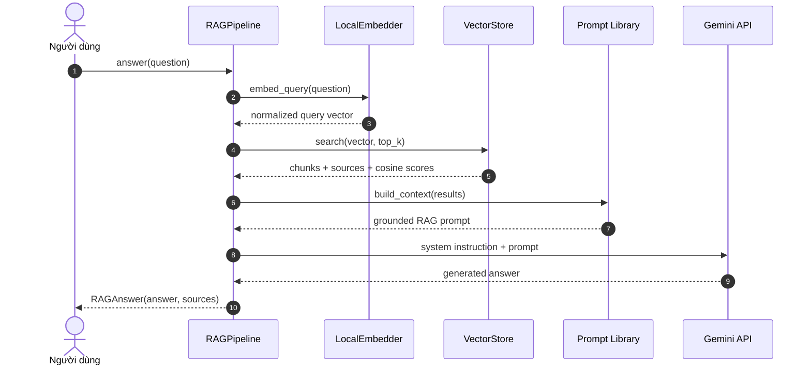

<div align="center">


# RAG From Zero

### Xây dựng pipeline Retrieval-Augmented Generation bằng Python, local embeddings, Google Gemini và Ollama (100% Offline)

Một project RAG nhỏ gọn giúp bạn nhìn rõ toàn bộ quy trình **Load → Chunk → Embed → Store → Retrieve → Generate**, không phụ thuộc vào framework orchestration phức tạp.

[](https://www.python.org/)
[](https://ollama.com/)
[](https://ai.google.dev/)
[](https://numpy.org/)
[](#embedding-cuc-bo)
[](https://github.com/QuocTien004/RAG-from-zero/stargazers)

**[Bắt đầu nhanh](#bat-dau-nhanh) · [Kiến trúc](#kien-truc-he-thong) · [Cách hoạt động](#rag-hoat-dong-nhu-the-nao) · [Cấu hình](#cau-hinh) · [Xử lý lỗi](#xu-ly-loi-thuong-gap) · [Nguồn tham khảo](#nguon-tham-khao)**

</div>

---

<a id="tong-quan"></a>
## Tổng quan

LLM có thể diễn đạt tốt nhưng không tự biết tài liệu riêng của bạn và có thể trả lời thiếu căn cứ. RAG bổ sung một bước tìm kiếm trước khi sinh câu trả lời:

1. **Retrieval:** tìm các đoạn tài liệu gần nghĩa nhất với câu hỏi.
2. **Augmentation:** ghép các đoạn tìm được thành ngữ cảnh có nguồn.
3. **Generation:** yêu cầu LLM chỉ trả lời dựa trên ngữ cảnh đó.

Project triển khai RAG thành hai pipeline độc lập:



### Điểm nổi bật

| Khả năng | Chi tiết |
|---|---|
| **Hybrid Multimodal RAG** | Kết hợp 3 kỹ thuật: OCR cục bộ (EasyOCR) + Vision AI (Gemini) + Visual Grounding (gửi ảnh gốc cho LLM) |
| **Dual LLM Provider** | Hỗ trợ song song cả **Ollama** (100% offline trên máy, không cần mạng, 0đ API) và **Google Gemini** (Cloud API) |
| **Nạp bù thông minh** | Quản lý bằng mã băm SHA-256 (`manifest.json`): chỉ nhúng file mới/sửa đổi, tự động dọn dẹp file bị xóa |
| **Đa dạng định dạng tài liệu** | Nạp đệ quy văn bản (`.txt`, `.md`), PDF, Word (`.docx`) và tệp hình ảnh (`.png`, `.jpg`, `.jpeg`, `.webp`, `.bmp`) |
| **Bóc tách ảnh nhúng từ PDF & Word** | Tự động trích xuất các hình vẽ/biểu đồ trong PDF và DOCX vào `data/processed/extracted_images/` để lập chỉ mục |
| **Embedding cục bộ & Offline Search** | Dùng `multilingual-e5-small`, hỗ trợ tiếng Việt, không tốn quota API; có tool tìm kiếm 100% offline |
| **Vector store tối giản** | Lưu vector bằng NumPy (.npz + .meta.json), tìm kiếm cosine bằng phép nhân ma trận |
| **Trả lời trực quan có nguồn** | Mỗi kết quả giữ tên file, nội dung chunk, điểm tương đồng và đường dẫn hình ảnh đính kèm |
| **Prompt chống bịa** | LLM được yêu cầu chỉ dùng ngữ cảnh và nói rõ khi thiếu thông tin |
| **Có kiểm thử offline** | 8 smoke tests cho chunking, retrieval, multimodal search và Ollama initialization không cần gọi API |

> Thiết kế ưu tiên tính trực quan, độc lập và làm chủ toàn bộ luồng dữ liệu của kiến trúc RAG trước khi tích hợp các vector database chuyên dụng.

<a id="kien-truc-he-thong"></a>
## Kiến trúc hệ thống

`RAGPipeline` là composition root kết nối các module. Phần embedding và retrieval chạy trên máy; chỉ prompt cuối gồm câu hỏi cùng các chunk được truy xuất mới được gửi tới Gemini.



### Trách nhiệm của từng module

| Module | Trách nhiệm |
|---|---|
| `config.py` | Đọc `.env`, kiểm tra API key và tập trung toàn bộ tham số RAG (đường dẫn, kích thước chunk, top_k...) |
| `loader.py` | Quét đệ quy `data/raw/`, bóc tách text và trích xuất hình ảnh nhúng từ PDF, hỗ trợ ảnh độc lập |
| `multimodal.py` | Kết hợp OCR cục bộ (EasyOCR) và Gemini Vision để tạo Rich Image Chunk, lưu vết đường dẫn ảnh gốc |
| `chunker.py` | Chia tài liệu theo số ký tự kèm overlap cấu hình được; bảo toàn liên kết `image_path` cho từng chunk |
| `embeddings.py` | Tạo normalized vectors; tự thêm tiền tố `query:`/`passage:` cho model multilingual-e5 |
| `vector_store.py` | Chuẩn hóa vector, tìm kiếm cosine, lưu NPZ và metadata JSON (bao gồm thuộc tính `image_path`) |
| `prompts.py` | Quản lý system prompt, RAG template và cách ghép context (chú thích hình ảnh kèm theo) |
| `llm.py` | Bao lời gọi `generate_content` của Google Gen AI SDK, hỗ trợ truyền hình ảnh trực quan kèm prompt |
| `pipeline.py` | Điều phối `ingest()` (quản lý SHA-256 manifest) và `answer()` (truy xuất và gửi kèm ảnh cho LLM) |

<a id="rag-hoat-dong-nhu-the-nao"></a>
## RAG hoạt động như thế nào?

### Giai đoạn ingestion (Multimodal + Incremental)

Chạy khi khởi tạo hoặc khi có tài liệu mới được thêm/sửa/xóa:

1. **Quét & So sánh Hash:** Loader tính mã băm SHA-256 của từng file trong `data/raw/` và so với `manifest.json`. File không đổi sẽ được bỏ qua.
2. **Xử lý Đa phương thức:**
   - **Văn bản thuần (.txt, .md):** Đọc trực tiếp nội dung UTF-8.
   - **File PDF:** Trích xuất lớp văn bản (text layer), đồng thời bóc tách toàn bộ hình vẽ, biểu đồ nhúng bên trong vào thư mục `data/processed/extracted_images/`.
   - **File ảnh độc lập (.png, .jpg, .webp...):** `MultimodalProcessor` dùng EasyOCR để nhận diện toàn bộ chữ, số, bảng biểu, đồng thời dùng Gemini Vision để tóm tắt ý nghĩa sơ đồ. Toàn bộ thông tin được tổng hợp thành Rich Image Chunk gắn kèm `image_path`.
3. **Phân đoạn (Chunking):** Chia văn bản thành các đoạn nhỏ `RAG_CHUNK_SIZE` với phần chồng lấn `RAG_CHUNK_OVERLAP` ký tự.
4. **Nhúng Vector (Embedding):** `LocalEmbedder` biến các chunk thành vector `float32` đã chuẩn hóa qua model multilingual E5.
5. **Lưu trữ:** Lưu vector vào `.npz`, metadata kèm đường dẫn ảnh vào `.meta.json`, và ghi nhận trạng thái vào `manifest.json`.

### Giai đoạn query



Gemini client retry tối đa bốn lần cho các lỗi tạm thời `429`, `500`, `502`, `503` và `504`, với thời gian chờ tăng dần nhưng được giới hạn.

<a id="bat-dau-nhanh"></a>
## Bắt đầu nhanh

### Yêu cầu

- Python **3.10+**
- Một Google Gemini API key
- Dung lượng trống cho model embedding và Python dependencies
- Kết nối mạng trong lần đầu tải model embedding và khi gọi Gemini

### 1. Clone repository

```bash
git clone https://github.com/QuocTien004/RAG-from-zero.git
cd RAG-from-zero
```

### 2. Tạo môi trường và cài dependencies

<details open>
<summary><strong>Windows PowerShell</strong></summary>

```powershell
python -m venv .venv
.\.venv\Scripts\Activate.ps1
pip install -r requirements.txt
Copy-Item .env.example .env
```

</details>

<details>
<summary><strong>macOS / Linux</strong></summary>

```bash
python3 -m venv .venv
source .venv/bin/activate
pip install -r requirements.txt
cp .env.example .env
```

</details>

### 3. Cấu hình Gemini

Mở `.env` và điền API key:

```dotenv
GEMINI_API_KEY=your_api_key_here
GEMINI_CHAT_MODEL=gemini-flash-latest
```

> **Bảo mật:** `.env` đã được Git bỏ qua. Không commit, chụp màn hình hoặc chia sẻ API key. Dù ingestion không gọi Gemini, phiên bản hiện tại vẫn kiểm tra key khi khởi tạo pipeline.

### 4. Ingest tài liệu

Hệ thống tích hợp cơ chế **Nạp bù thông minh (Incremental Ingestion)** bằng mã băm SHA-256:

```bash
# Nạp bù thông minh: chỉ nhúng file mới hoặc vừa sửa đổi, bỏ qua file cũ
python scripts/ingest.py

# Ép buộc xây dựng lại toàn bộ vector store từ đầu:
python scripts/ingest.py --force
```

Lần chạy đầu, Sentence Transformers tải model embedding về cache cục bộ. Các lần sau, hệ thống tự động nhận biết file mới thêm, file bị chỉnh sửa hoặc file đã xóa để cập nhật vector store mà không phải nhúng lại toàn bộ tài liệu.

### 5. Đặt câu hỏi

Hỏi một câu rồi thoát:

```bash
python scripts/ask.py "RAG gồm những bước nào?"
```

Mở chế độ hỏi đáp liên tục:

```bash
python scripts/ask.py
```

Nếu câu trả lời liên quan tới sơ đồ/hình ảnh, kết quả sẽ hiển thị đường dẫn `🖼️ Hình ảnh đính kèm` và gửi trực tiếp hình ảnh gốc cho Gemini LLM để trả lời trực quan.

### 6. Tìm kiếm ngữ nghĩa 100% Offline (Không cần API)

```bash
python scripts/search_local.py "Muốn model biết dữ liệu mới mà không fine-tune thì làm gì?"
```

Chạy hoàn toàn cục bộ trên máy tính (sử dụng vector store NumPy + model embedding E5), không tốn quota hay cần API key.

<a id="su-dung-tai-lieu-rieng"></a>
## Sử dụng tài liệu riêng

1. Chép file vào `data/raw/`; có thể tổ chức thành nhiều thư mục con.
2. Chạy `python scripts/ingest.py` (hệ thống sẽ tự nhận biết file mới/sửa đổi qua SHA-256).
3. Chạy `python scripts/ask.py` hoặc `python scripts/search_local.py`.

| Định dạng | Cách xử lý | Lưu ý |
|---|---|---|
| `.txt` | Đọc trực tiếp dưới dạng UTF-8 | File encoding khác UTF-8 có thể gây lỗi |
| `.md`, `.markdown` | Đọc như văn bản thuần | Markdown syntax được giữ trong chunk |
| `.pdf` | Trích xuất text layer + tự động bóc tách hình ảnh nhúng vào `data/processed/extracted_images/` | Hình ảnh bóc tách được phân tích tự động bằng OCR + Vision |
| `.png`, `.jpg`, `.jpeg`, `.webp`, `.bmp` | Phân tích kết hợp EasyOCR (chữ/bảng số liệu) và Gemini Vision (ngữ nghĩa biểu đồ/sơ đồ) | Tạo Rich Image Chunk và lưu vết đường dẫn ảnh gốc để truy xuất |

File rỗng và định dạng không hỗ trợ được bỏ qua. Tên nguồn trong kết quả là đường dẫn tương đối tính từ `data/raw/`.

<a id="embedding-cuc-bo"></a>
## Embedding cục bộ và tìm kiếm cosine

Model mặc định là `intfloat/multilingual-e5-small`, chạy qua Sentence Transformers:

- Tài liệu được thêm tiền tố `passage:`.
- Câu hỏi được thêm tiền tố `query:`.
- Vector được chuẩn hóa L2 ngay khi encode.
- Cosine similarity trở thành phép nhân ma trận `vectors @ query`.
- Kết quả được sắp xếp giảm dần và lấy `RAG_TOP_K` phần tử đầu.

Embedding không tiêu thụ quota Gemini. Tuy nhiên, lần chạy đầu phải tải model về máy và tốc độ phụ thuộc CPU/phần cứng cục bộ.

<a id="cau-hinh"></a>
## Cấu hình

| Biến | Mặc định | Mô tả |
|---|---:|---|
| `LLM_PROVIDER` | `ollama` (nếu không có key) / `gemini` | Chọn mô hình sinh câu trả lời: `ollama` (100% offline) hoặc `gemini` (cloud API) |
| `OLLAMA_MODEL` | `qwen2.5:3b` | Tên mô hình chạy cục bộ qua Ollama (`qwen2.5:3b`, `qwen2.5:7b`, `llama3.1`...) |
| `OLLAMA_BASE_URL` | `http://localhost:11434` | Địa chỉ REST API của máy chủ Ollama nội bộ |
| `GEMINI_API_KEY` | Bắt buộc (khi dùng Gemini) | API key dùng cho bước generation và Vision captioning khi dùng Google AI |
| `GEMINI_CHAT_MODEL` | `gemini-flash-latest` | Model Gemini sinh câu trả lời trên cloud |
| `EMBED_MODEL` | `intfloat/multilingual-e5-small` | Sentence Transformers model chạy cục bộ (0đ API) |
| `RAG_CHUNK_SIZE` | `800` | Số ký tự tối đa trong mỗi chunk |
| `RAG_CHUNK_OVERLAP` | `120` | Số ký tự lặp lại giữa hai chunk liền nhau |
| `RAG_TOP_K` | `4` | Số chunk được đưa vào prompt cho mỗi câu hỏi |

`RAG_CHUNK_OVERLAP` phải nhỏ hơn `RAG_CHUNK_SIZE`; nếu không, chunker sẽ báo `ValueError`.

### Dùng package trong Python

Sau khi cài dependencies, có thể cài package ở editable mode:

```bash
pip install -e .
```

```python
from rag import RAGPipeline

pipeline = RAGPipeline()

chunk_count = pipeline.ingest()
result = pipeline.answer("RAG giải quyết vấn đề gì?")

print(result.answer)
for source in result.sources:
    print(source.source, source.score, source.image_path)
```

`ingest()` trả về số chunk đã tạo. `answer()` trả về `RAGAnswer` gồm văn bản trả lời và danh sách `SearchResult` đã dùng (kèm `image_path` nếu có).

<a id="kiem-thu"></a>
## Kiểm thử

```bash
python -m pytest
```

Bộ 6 smoke tests kiểm tra:

- Chunk không vượt quá kích thước cấu hình và giữ đúng phần overlap.
- Chuỗi rỗng không sinh chunk.
- Vector store xếp hạng kết quả đúng theo cosine similarity.
- Vector store thêm và loại bỏ nguồn (incremental update) chính xác.
- Bảo toàn `image_path` khi chia chunk cho tài liệu đa phương thức.
- Truy xuất vector store và định dạng ngữ cảnh kèm đường dẫn hình ảnh đính kèm.

Các test dùng vector giả lập, không tải embedding model, không gọi Gemini và không tiêu thụ API quota.

<a id="cau-truc-thu-muc"></a>
## Cấu trúc thư mục

```text
RAG-from-zero/
├── data/
│   ├── raw/
│   │   ├── 01-rag-la-gi.md
│   │   └── 02-embedding-va-vector-store.md
│   └── processed/
│       ├── extracted_images/ # Thư mục lưu ảnh trích xuất từ PDF
│       ├── manifest.json     # Quản lý hash SHA-256 nạp bù
│       └── vector_store.npz  # Vector store + .meta.json
├── scripts/
│   ├── ingest.py             # Nạp bù thông minh vào vector store
│   ├── ask.py                # Hỏi đáp Multimodal RAG với Gemini
│   └── search_local.py       # Tìm kiếm ngữ nghĩa 100% offline
├── src/rag/
│   ├── __init__.py           # Public package API
│   ├── config.py             # Environment settings
│   ├── loader.py             # TXT, Markdown, PDF và Image loader
│   ├── multimodal.py         # EasyOCR cục bộ + Gemini Vision processor
│   ├── chunker.py            # Character-based chunking kèm image_path
│   ├── embeddings.py         # Local Sentence Transformers embeddings
│   ├── vector_store.py       # NumPy cosine search + metadata image persistence
│   ├── prompts.py            # System prompt và RAG template có visual context
│   ├── llm.py                # Gemini adapter hỗ trợ truyền hình ảnh trực quan
│   └── pipeline.py           # RAGPipeline điều phối Ingestion & Query
├── tests/
│   └── test_smoke.py         # 6 smoke unit tests offline
├── .env.example
├── .gitignore
├── pyproject.toml
├── requirements.txt
└── README.md
```

Để đọc code theo đúng luồng dữ liệu: `config.py` → `multimodal.py` → `loader.py` → `chunker.py` → `embeddings.py` → `vector_store.py` → `prompts.py` → `llm.py` → `pipeline.py`.

<a id="quyet-dinh-thiet-ke"></a>
## Quyết định thiết kế

- **Hybrid Multimodal RAG:** Kết hợp cả 3 kỹ thuật: OCR trích xuất chữ/số liệu bảng biểu + Vision AI đọc hiểu biểu đồ ngữ nghĩa + Visual LLM Grounding (gửi ảnh gốc cho LLM lúc trả lời).
- **Incremental Ingestion (SHA-256):** Tự động phát hiện file mới, sửa đổi hoặc xóa; chỉ nhúng các file thay đổi, tiết kiệm thời gian và tài nguyên CPU.
- **NumPy thay cho vector database:** Cho thấy retrieval thực chất là chuẩn hóa vector, nhân ma trận và sắp xếp điểm.
- **Local embeddings:** Giảm phụ thuộc API và tách rõ retrieval khỏi generation.
- **E5 query/passage prefixes:** Tuân theo cách sử dụng của họ model E5 để tối ưu chất lượng retrieval.
- **NPZ + JSON:** Vector và metadata dễ kiểm tra, xóa và tái tạo mà không cần dịch vụ ngoài.

<a id="gioi-han-va-an-toan"></a>
## Giới hạn và lưu ý an toàn

- Retrieval luôn lấy `top_k` kết quả, chưa có ngưỡng relevance tối thiểu hoặc reranker.
- EasyOCR chạy trên CPU tiêu thụ RAM và thời gian khởi tạo lần đầu; có thể bật GPU nếu môi trường hỗ trợ CUDA.
- NumPy search phù hợp demo hoặc tập dữ liệu vừa và nhỏ (< 50,000 chunks); hệ thống lớn nên dùng FAISS/Qdrant.
- Câu hỏi và các chunk được truy xuất sẽ được gửi tới Gemini khi dùng `ask.py`. Không dùng tài liệu nhạy cảm nếu chưa đánh giá chính sách dữ liệu.

<a id="xu-ly-loi-thuong-gap"></a>
## Xử lý lỗi thường gặp

| Hiện tượng | Nguyên nhân thường gặp | Cách xử lý |
|---|---|---|
| `Thiếu GEMINI_API_KEY` | Chưa tạo `.env` hoặc key đang trống | Sao chép `.env.example`, điền key rồi chạy lại (chỉ cần khi dùng `ask.py`) |
| `Chưa có vector store` | Chưa chạy ingestion | Chạy `python scripts/ingest.py` trước khi hỏi |
| `Không tìm thấy tài liệu nào` | `data/raw/` không có file được hỗ trợ | Thêm TXT, Markdown, PDF hoặc ảnh rồi ingest lại |
| `overlap phải nhỏ hơn chunk_size` | Cấu hình overlap không hợp lệ | Giảm `RAG_CHUNK_OVERLAP` hoặc tăng `RAG_CHUNK_SIZE` |
| `ModuleNotFoundError` | Chưa kích hoạt `.venv` hoặc thiếu dependencies | Kích hoạt venv và chạy `pip install -r requirements.txt` |
| Lần ingest đầu chạy lâu | Đang tải model embedding và model EasyOCR | Chờ tải xong; các lần sau dùng cache cục bộ |
| `429` hoặc `RESOURCE_EXHAUSTED` | Hết quota hay rate limit Gemini | Chờ rồi thử lại hoặc kiểm tra quota/billing |
| `5xx` từ Gemini | Dịch vụ tạm thời không khả dụng | Client tự retry có giới hạn; thử lại sau nếu vẫn lỗi |

<a id="lo-trinh"></a>
## Lộ trình mở rộng

- [ ] Semantic hoặc token-aware chunking.
- [ ] Relevance threshold và reranking (bằng cross-encoder).
- [x] Incremental ingestion theo SHA-256 hash (nạp bù thông minh).
- [x] Hybrid Multimodal RAG (kết hợp EasyOCR cục bộ + Gemini Vision).
- [x] Tự động bóc tách hình ảnh nhúng từ tệp PDF.
- [x] Visual LLM Grounding (gửi hình ảnh đính kèm cho mô hình sinh).
- [ ] FAISS, Chroma, Qdrant hoặc pgvector backend.
- [ ] Đánh giá retrieval bằng Recall@K, MRR và bộ câu hỏi chuẩn.
- [ ] Streaming response và giao diện web.
- [ ] Mở rộng thành AI Agent: điều phối nhiều tool qua Gemini, Claude hoặc OpenAI.

<a id="nguon-tham-khao"></a>
## Nguồn tham khảo

Dự án được xây dựng và phát triển dựa trên kiến trúc từ video hướng dẫn:
* **Video hướng dẫn:** [TikTok - Series Xây dựng RAG từ số 0](https://vt.tiktok.com/ZSbM79FrV/)

---

<div align="center">

Được xây dựng nhằm nghiên cứu và làm chủ kiến trúc RAG từ cơ chế nền tảng, từng bước một.

Nếu project hữu ích, hãy star repository để ủng hộ dự án! ⭐

</div>
