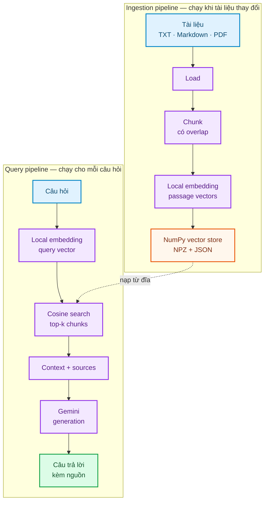
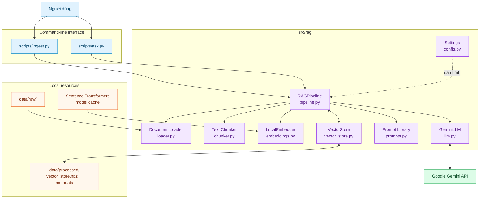
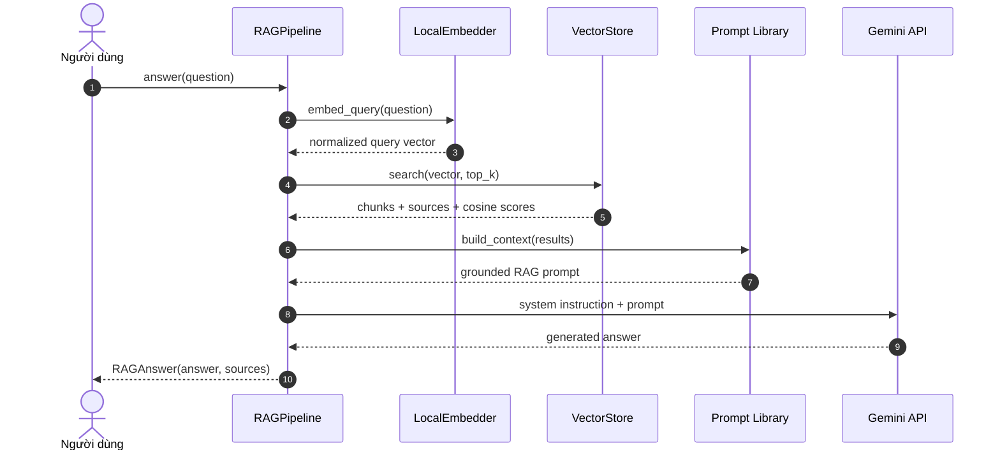

<div align="center">


# RAG From Zero

### Xây dựng pipeline Retrieval-Augmented Generation bằng Python, local embeddings và Google Gemini

Một project RAG nhỏ gọn giúp bạn nhìn rõ toàn bộ quy trình **Load → Chunk → Embed → Store → Retrieve → Generate**, không phụ thuộc vào framework orchestration phức tạp.

[](https://www.python.org/)
[](https://ai.google.dev/)
[](https://numpy.org/)
[](#embedding-cuc-bo)
[](https://github.com/breslee1707/RAG_FROM_ZERO/stargazers)

**[Bắt đầu nhanh](#bat-dau-nhanh) · [Kiến trúc](#kien-truc-he-thong) · [Cách hoạt động](#rag-hoat-dong-nhu-the-nao) · [Cấu hình](#cau-hinh) · [Xử lý lỗi](#xu-ly-loi-thuong-gap)**

</div>

---

<a id="tong-quan"></a>
## Tổng quan

LLM có thể diễn đạt tốt nhưng không tự biết tài liệu riêng của bạn và có thể trả lời thiếu căn cứ. RAG bổ sung một bước tìm kiếm trước khi sinh câu trả lời:

1. **Retrieval:** tìm các đoạn tài liệu gần nghĩa nhất với câu hỏi.
2. **Augmentation:** ghép các đoạn tìm được thành ngữ cảnh có nguồn.
3. **Generation:** yêu cầu LLM chỉ trả lời dựa trên ngữ cảnh đó.

Project triển khai RAG thành hai pipeline độc lập:



### Điểm nổi bật

| Khả năng | Chi tiết |
|---|---|
| **Pipeline minh bạch** | Mỗi bước RAG nằm trong một module nhỏ, có thể đọc và thay thế độc lập |
| **Embedding cục bộ** | Dùng `multilingual-e5-small`, hỗ trợ tiếng Việt và không tiêu thụ API embedding |
| **Vector store tối giản** | Lưu vector bằng NumPy, tìm kiếm cosine bằng phép nhân ma trận |
| **Trả lời có nguồn** | Mỗi kết quả giữ tên file, nội dung chunk và điểm tương đồng |
| **Nhiều định dạng tài liệu** | Nạp đệ quy `.txt`, `.md`, `.markdown` và `.pdf` |
| **Prompt chống bịa** | Gemini được yêu cầu chỉ dùng ngữ cảnh và nói rõ khi thiếu thông tin |
| **Có kiểm thử offline** | Smoke tests cho chunking và semantic ranking không gọi API |

> Đây là project học tập. Thiết kế ưu tiên khả năng quan sát và hiểu cơ chế RAG hơn các tối ưu dành cho production.

<a id="kien-truc-he-thong"></a>
## Kiến trúc hệ thống

`RAGPipeline` là composition root kết nối các module. Phần embedding và retrieval chạy trên máy; chỉ prompt cuối gồm câu hỏi cùng các chunk được truy xuất mới được gửi tới Gemini.



### Trách nhiệm của từng module

| Module | Trách nhiệm |
|---|---|
| `config.py` | Đọc `.env`, kiểm tra API key và tập trung toàn bộ tham số RAG |
| `loader.py` | Duyệt `data/raw/`, đọc văn bản và giữ đường dẫn nguồn tương đối |
| `chunker.py` | Chia tài liệu theo số ký tự với phần chồng lấn cấu hình được |
| `embeddings.py` | Tạo normalized vectors; tự thêm tiền tố `query:`/`passage:` cho model E5 |
| `vector_store.py` | Chuẩn hóa vector, tìm kiếm cosine, lưu NPZ và metadata JSON |
| `prompts.py` | Quản lý system prompt, RAG template và cách ghép context |
| `llm.py` | Bao lời gọi `generate_content` của Google Gen AI SDK |
| `pipeline.py` | Điều phối `ingest()` và `answer()`, cache vector store trong bộ nhớ |

<a id="rag-hoat-dong-nhu-the-nao"></a>
## RAG hoạt động như thế nào?

### Giai đoạn ingestion

Chạy lại khi thêm hoặc sửa tài liệu:

1. Loader đọc đệ quy các file được hỗ trợ.
2. Mỗi tài liệu được chia thành chunk dài `RAG_CHUNK_SIZE` ký tự.
3. Hai chunk liền nhau chia sẻ `RAG_CHUNK_OVERLAP` ký tự để giảm mất ngữ cảnh ở biên.
4. `LocalEmbedder` biến các chunk thành vector `float32` đã chuẩn hóa.
5. `VectorStore` lưu vector vào `.npz` và metadata vào `.meta.json`.

### Giai đoạn query



Gemini client retry tối đa bốn lần cho các lỗi tạm thời `429`, `500`, `502`, `503` và `504`, với thời gian chờ tăng dần nhưng được giới hạn.

<a id="bat-dau-nhanh"></a>
## Bắt đầu nhanh

### Yêu cầu

- Python **3.10+**
- Một Google Gemini API key
- Dung lượng trống cho model embedding và Python dependencies
- Kết nối mạng trong lần đầu tải model embedding và khi gọi Gemini

### 1. Clone repository

```bash
git clone https://github.com/breslee1707/RAG_FROM_ZERO.git
cd RAG_FROM_ZERO
```

### 2. Tạo môi trường và cài dependencies

<details open>
<summary><strong>Windows PowerShell</strong></summary>

```powershell
python -m venv .venv
.\.venv\Scripts\Activate.ps1
pip install -r requirements.txt
Copy-Item .env.example .env
```

</details>

<details>
<summary><strong>macOS / Linux</strong></summary>

```bash
python3 -m venv .venv
source .venv/bin/activate
pip install -r requirements.txt
cp .env.example .env
```

</details>

### 3. Cấu hình Gemini

Mở `.env` và điền API key:

```dotenv
GEMINI_API_KEY=your_api_key_here
GEMINI_CHAT_MODEL=gemini-flash-latest
```

> **Bảo mật:** `.env` đã được Git bỏ qua. Không commit, chụp màn hình hoặc chia sẻ API key. Dù ingestion không gọi Gemini, phiên bản hiện tại vẫn kiểm tra key khi khởi tạo pipeline.

### 4. Ingest tài liệu

Project có sẵn hai tài liệu Markdown mẫu trong `data/raw/`:

```bash
python scripts/ingest.py
```

Lần chạy đầu, Sentence Transformers tải model embedding về cache cục bộ. Sau khi hoàn tất, vector store được tạo trong `data/processed/`.

### 5. Đặt câu hỏi

Hỏi một câu rồi thoát:

```bash
python scripts/ask.py "RAG gồm những bước nào?"
```

Mở chế độ hỏi đáp liên tục:

```bash
python scripts/ask.py
```

Kết quả gồm câu trả lời, danh sách chunk nguồn và điểm tương đồng cosine của từng chunk.

<a id="su-dung-tai-lieu-rieng"></a>
## Sử dụng tài liệu riêng

1. Chép file vào `data/raw/`; có thể tổ chức thành nhiều thư mục con.
2. Chạy lại `python scripts/ingest.py` để xây dựng lại toàn bộ vector store.
3. Chạy `python scripts/ask.py` và đặt câu hỏi liên quan tới tài liệu.

| Định dạng | Cách xử lý | Lưu ý |
|---|---|---|
| `.txt` | Đọc trực tiếp dưới dạng UTF-8 | File encoding khác UTF-8 có thể gây lỗi |
| `.md`, `.markdown` | Đọc như văn bản thuần | Markdown syntax được giữ trong chunk |
| `.pdf` | Trích xuất text layer bằng `pypdf` | PDF scan dạng ảnh chưa được OCR |

File rỗng và định dạng không hỗ trợ được bỏ qua. Tên nguồn trong kết quả là đường dẫn tương đối tính từ `data/raw/`.

<a id="embedding-cuc-bo"></a>
## Embedding cục bộ và tìm kiếm cosine

Model mặc định là `intfloat/multilingual-e5-small`, chạy qua Sentence Transformers:

- Tài liệu được thêm tiền tố `passage:`.
- Câu hỏi được thêm tiền tố `query:`.
- Vector được chuẩn hóa L2 ngay khi encode.
- Cosine similarity trở thành phép nhân ma trận `vectors @ query`.
- Kết quả được sắp xếp giảm dần và lấy `RAG_TOP_K` phần tử đầu.

Embedding không tiêu thụ quota Gemini. Tuy nhiên, lần chạy đầu phải tải model về máy và tốc độ phụ thuộc CPU/phần cứng cục bộ.

<a id="cau-hinh"></a>
## Cấu hình

| Biến | Mặc định | Mô tả |
|---|---:|---|
| `GEMINI_API_KEY` | Bắt buộc | API key dùng cho bước generation |
| `GEMINI_CHAT_MODEL` | `gemini-flash-latest` | Model Gemini sinh câu trả lời |
| `EMBED_MODEL` | `intfloat/multilingual-e5-small` | Sentence Transformers model chạy cục bộ |
| `RAG_CHUNK_SIZE` | `800` | Số ký tự tối đa trong mỗi chunk |
| `RAG_CHUNK_OVERLAP` | `120` | Số ký tự lặp lại giữa hai chunk liền nhau |
| `RAG_TOP_K` | `4` | Số chunk được đưa vào prompt cho mỗi câu hỏi |

`RAG_CHUNK_OVERLAP` phải nhỏ hơn `RAG_CHUNK_SIZE`; nếu không, chunker sẽ báo `ValueError`.

### Dùng package trong Python

Sau khi cài dependencies, có thể cài package ở editable mode:

```bash
pip install -e .
```

```python
from rag import RAGPipeline

pipeline = RAGPipeline()

chunk_count = pipeline.ingest()
result = pipeline.answer("RAG giải quyết vấn đề gì?")

print(result.answer)
for source in result.sources:
    print(source.source, source.score)
```

`ingest()` trả về số chunk đã tạo. `answer()` trả về `RAGAnswer` gồm văn bản trả lời và danh sách `SearchResult` đã dùng.

<a id="kiem-thu"></a>
## Kiểm thử

```bash
python -m pytest
```

Ba smoke tests hiện tại kiểm tra:

- Chunk không vượt quá kích thước cấu hình và giữ đúng phần overlap.
- Chuỗi rỗng không sinh chunk.
- Vector store xếp hạng kết quả đúng theo cosine similarity.

Các test dùng vector giả lập, không tải embedding model, không gọi Gemini và không tiêu thụ API quota.

<a id="cau-truc-thu-muc"></a>
## Cấu trúc thư mục

```text
RAG_FROM_ZERO/
├── data/
│   ├── raw/
│   │   ├── 01-rag-la-gi.md
│   │   └── 02-embedding-va-vector-store.md
│   └── processed/
│       └── .gitkeep
├── scripts/
│   ├── ingest.py             # Xây dựng lại vector store
│   └── ask.py                # Hỏi một câu hoặc chat liên tục
├── src/rag/
│   ├── __init__.py           # Public package API
│   ├── config.py             # Environment settings
│   ├── loader.py             # TXT, Markdown và PDF loader
│   ├── chunker.py            # Character-based chunking
│   ├── embeddings.py         # Local Sentence Transformers embeddings
│   ├── vector_store.py       # NumPy cosine search + persistence
│   ├── prompts.py            # System prompt và RAG template
│   ├── llm.py                # Gemini generation adapter
│   └── pipeline.py           # RAGPipeline orchestration
├── tests/
│   └── test_smoke.py
├── .env.example
├── .gitignore
├── pyproject.toml
├── requirements.txt
└── README.md
```

Để đọc code theo đúng luồng dữ liệu: `config.py` → `loader.py` → `chunker.py` → `embeddings.py` → `vector_store.py` → `prompts.py` → `llm.py` → `pipeline.py`.

<a id="quyet-dinh-thiet-ke"></a>
## Quyết định thiết kế

- **NumPy thay cho vector database:** cho thấy retrieval thực chất là chuẩn hóa vector, nhân ma trận và sắp xếp điểm.
- **Character chunking:** dễ quan sát và cấu hình; phù hợp bài nhập môn trước khi chuyển sang semantic/token chunking.
- **Local embeddings:** giảm phụ thuộc API và tách rõ retrieval khỏi generation.
- **E5 query/passage prefixes:** tuân theo cách sử dụng của họ model E5 để cải thiện chất lượng retrieval.
- **NPZ + JSON:** vector và metadata dễ kiểm tra, xóa và tái tạo mà không cần dịch vụ ngoài.
- **Lazy-load vector store:** chỉ đọc dữ liệu từ đĩa khi `answer()` thực sự được gọi, sau đó cache trong pipeline.
- **Prompt tập trung:** chỉ dẫn grounding và template nằm riêng, không trộn vào logic điều phối.

<a id="gioi-han-va-an-toan"></a>
## Giới hạn và lưu ý an toàn

- Retrieval luôn lấy `top_k` kết quả, chưa có ngưỡng relevance tối thiểu hoặc reranker.
- Ingestion xây dựng lại toàn bộ store; chưa hỗ trợ cập nhật/xóa tài liệu theo từng phần.
- Chunking theo ký tự có thể cắt giữa câu hoặc cấu trúc Markdown.
- PDF ảnh scan không có text layer cần OCR trước khi ingest.
- NumPy search phù hợp demo hoặc tập dữ liệu nhỏ; chưa tối ưu cho hàng triệu vector.
- Câu hỏi và các chunk được truy xuất sẽ được gửi tới Gemini. Không dùng tài liệu nhạy cảm nếu chưa đánh giá chính sách dữ liệu của provider.
- Metadata được nạp từ file JSON cục bộ; chỉ sử dụng vector store do bạn tạo hoặc tin cậy.
- Project chưa có authentication, rate limiting, telemetry hoặc giao diện web.

<a id="xu-ly-loi-thuong-gap"></a>
## Xử lý lỗi thường gặp

| Hiện tượng | Nguyên nhân thường gặp | Cách xử lý |
|---|---|---|
| `Thiếu GEMINI_API_KEY` | Chưa tạo `.env` hoặc key đang trống | Sao chép `.env.example`, điền key rồi chạy lại |
| `Chưa có vector store` | Chưa chạy ingestion | Chạy `python scripts/ingest.py` trước khi hỏi |
| `Không tìm thấy tài liệu nào` | `data/raw/` không có file được hỗ trợ | Thêm TXT, Markdown hoặc PDF rồi ingest lại |
| `overlap phải nhỏ hơn chunk_size` | Cấu hình overlap không hợp lệ | Giảm `RAG_CHUNK_OVERLAP` hoặc tăng `RAG_CHUNK_SIZE` |
| `ModuleNotFoundError` | Chưa kích hoạt `.venv` hoặc thiếu dependencies | Kích hoạt venv và chạy `pip install -r requirements.txt` |
| Lần ingest đầu chạy lâu | Đang tải và khởi tạo embedding model | Chờ tải xong; các lần sau dùng cache cục bộ |
| PDF không sinh nội dung | File là ảnh scan hoặc text layer lỗi | OCR file trước khi đưa vào `data/raw/` |
| `429` hoặc `RESOURCE_EXHAUSTED` | Hết quota hay rate limit Gemini | Chờ rồi thử lại hoặc kiểm tra quota/billing |
| `5xx` từ Gemini | Dịch vụ tạm thời không khả dụng | Client tự retry có giới hạn; thử lại sau nếu vẫn lỗi |
| Trả lời không liên quan | Chunking/top-k chưa phù hợp hoặc thiếu tài liệu | Điều chỉnh cấu hình, thêm dữ liệu hoặc bổ sung reranker |

<a id="lo-trinh"></a>
## Lộ trình mở rộng

- [ ] Semantic hoặc token-aware chunking.
- [ ] Relevance threshold và reranking.
- [ ] Incremental ingestion theo document ID/hash.
- [ ] FAISS, Chroma, Qdrant hoặc pgvector backend.
- [ ] OCR cho PDF scan.
- [ ] Đánh giá retrieval bằng Recall@K, MRR và bộ câu hỏi chuẩn.
- [ ] Streaming response và giao diện web.
- [ ] Biến `RAGPipeline.answer()` thành tool cho AI Agent.

Project tiếp theo trong series: [AI Agent From Zero](https://github.com/breslee1707/AI_AGENT_FROM_ZERO) — điều phối nhiều tool qua Gemini, Claude hoặc OpenAI.

<a id="dong-gop"></a>
## Đóng góp

Issue và pull request đều được chào đón. Khi thay đổi chunking, embedding hoặc retrieval, hãy bổ sung test và mô tả ảnh hưởng tới chất lượng tìm kiếm.

```bash
git checkout -b feature/ten-tinh-nang
git commit -m "feat: mô tả thay đổi"
git push origin feature/ten-tinh-nang
```

---

<div align="center">

Được xây dựng để học RAG từ cơ chế nền tảng, từng bước một.

Nếu project hữu ích, hãy star repository để ủng hộ series.

</div>
